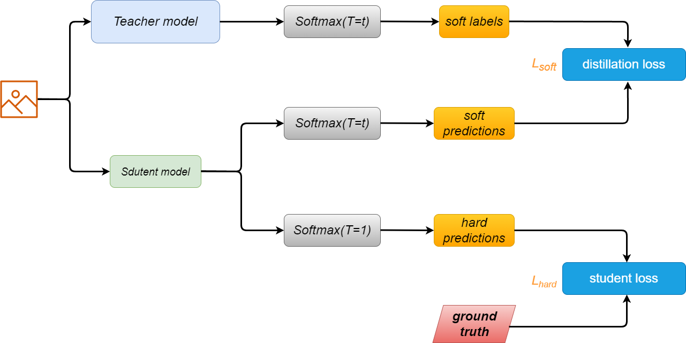

## Distilling the Knowledge in a Neural Network

- 将繁琐模型的泛化能力转移到小模型的一种明显方法是使用繁琐模型产生的类概率作为“soft target”来训练小模型。
  - 对于这个转移阶段，我们可以使用相同的训练集或一个单独的“转移”集。
- 当繁琐的模型是更简单的模型的大型集合时，我们可以使用它们各自的预测分布的算术或几何平均值作为软目标。

> **当软目标具有较高的熵时**，每个训练案例提供的信息比硬目标多得多，训练案例之间的梯度差异要小得多，**因此小型模型通常可以根据比原始繁琐模型少得多的数据进行训练，并使用更高的学习率**。

> **一言以蔽之，teacher-student之间应该采用 “soft target” 作为损失，并使用更高的学习率**

--------------------------

### 举例对上述所说的较高的熵给一个直观的解释
- 比如对于MNIST这种数据集，**复杂模型总是会为正确答案提供很高的置信度，但是错误答案也应该有很多的信息**。比如说 2 被识别成 3 的概率可能是 $10^{-6}$，被识别成 7 的概率可能是 $10^{-9}$，这是非常有价值的信息，它定义了数据的**丰富相似性结构**。

- 但是通常由于他们过完交叉熵都非常接近 0 ，**得不到这里的信息**

### 解决方案
1. **Caruana 通过使用 logits（最终 softmax 的输入）而不是 softmax 产生的概率作为学习小模型的目标来规避这个问题，并且它们最小化了复杂模型产生的 logits 与小模型产生的 logits 之间的平方差**

2. **本文作者提出更一般的方案，让大小模型使用相同的`softmax temperature`去进行匹配。作者将这件事称为 `distillation`，也就是提高最终`softmax`的温度**
   - 这个温度要逐步提高，直到找到一个**合适的温度**，使得复杂模型产生一个合适的 `soft set of targets`
   - **两个模型的温度要一致**

> 经作者证明，方案一为方案二的一个特例

-----------------------------------------

- 训练小模型可以使用 **original training set**，也可以使用 **unlabeled data**

- 但是使用 **original training set** 更好，最好再引入和 **ground truth** 相关的损失，**这样可以避免 teacher 的错误，或者当无法 match teacher 的输出时，可以避免 student 的错误**

> 训练时采用**温度为 T 的softmax**，但是训练之后要把温度去掉，也就是说，**采用原始的softmax**

--------------------------------------

### 方法

$$ L = \alpha L_{soft} + \beta L_{hard} $$
$$ L_{soft} = -\sum_{i}q_i\log(p_i) $$

- 其中，$q_i$ 是 teacher 在温度T下的输出在第 i 个类别上的概率，$p_i$ 是 student 在温度T下的输出在第 i 个类别上的概率

- 损失采用交叉熵

> **由于梯度原因，$\alpha$ 通常为 $\beta$ 的 $T^2$ 倍**

--------------------------------------

### 实验

#### MNIST

1. 复杂模型，使用drop & regularization，激活函数使用 ReLU
2. 简单模型，使用更少的隐藏单元，激活函数使用 ReLU
3. 直接对比结果
4. 仅使用 $L_{soft}$，不使用 $L_{hard}$
5. 使用完整的 L
6. 调节不同的温度系数

> **模型更加鲁棒，在 MNIST 上去掉 3 去训练，不妨碍最终测试的结果**

#### 语音识别
#### 并行训练，Jet数据集

#### 实验经验
- temperature 通常取 [1, 2, 5, 10]，2 最好
- $L_{hard}$ 取 0.5 的相对权重

--------------------------------------

### 思考

- $L_{soft}$ 可是看作是一种正则，使得模型减少过拟合

- 知识蒸馏和直接从头训练区别在哪？
  - 收敛的形式不一样，大模型的隐藏层比较复杂，搜索的空间比较大，收敛的位置更平滑，也就是得到的解空间更优美。让大模型指导小模型，能让二者的解空间尽量逼近，收敛的位置尽量接近。**说句专业的话，就是让二者的模型参数之间的散度尽量小。**

---------------------------------

- **`distill`时候的学习率要给大一些**
- 调节合适的温度
- 对于大模型使用一定的方式，加快收敛速度
- **对于 $L_{soft}$ 的相对权重，可以通过打印中间梯度来确定一下，这个超参非常重要。**
- **可以动态调整学习率**